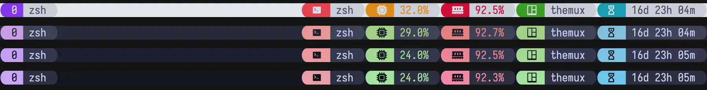
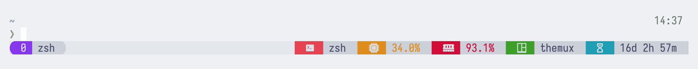
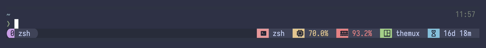
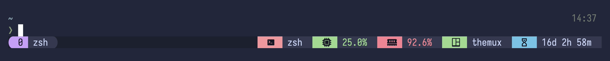
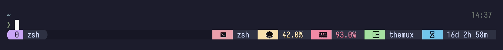

<!-- markdownlint-disable -->
<h1 align="center">themux</h1>
<p align="center">A themed, multi-theme status line for <a href="https://github.com/tmux/tmux">tmux</a>.</p>

<p align="center">
    <a href="https://github.com/jals1212/themux/stargazers"></a>
    <a href="https://github.com/jals1212/themux/issues"></a>
    <a href="https://github.com/jals1212/themux/contributors"></a>
</p>

<p align="center">
  
</p>
<!-- markdownlint-enable -->

## Themes

themux ships the catppuccin, kanagawa and kanso palettes and adds its own
component-based styling — see [multi-theme selection](#multi-theme-selection)
for the full list. Catppuccin flavor previews:

<details>
<summary>🌻 Latte</summary>



</details>
<details>
<summary>🪴 Frappé</summary>



</details>
<details>
<summary>🌺 Macchiato</summary>



</details>
<details>
<summary>🌿 Mocha</summary>



</details>

### Multi-theme selection
This fork is a multi-theme manager: besides the catppuccin flavors, other
themes can be selected with `@themux_theme`, which loads
`themes/<theme>.palette` (a plain `name hex` palette — a legacy
`themes/<theme>_tmux.conf` with `set -ogq @thm_*` still works for custom themes):

```sh
# Kanagawa (wave, dragon or lotus)
set -g @themux_theme 'kanagawa_dragon'

# Kanso (zen, ink, mist or pearl)
set -g @themux_theme 'kanso_zen'

# Catppuccin (latte, frappe, macchiato or mocha)
set -g @themux_theme 'catppuccin_frappe'
```

Available themes: `catppuccin_latte`, `catppuccin_frappe`,
`catppuccin_macchiato`, `catppuccin_mocha`, `kanagawa_wave`,
`kanagawa_dragon`, `kanagawa_lotus`, `kanso_zen`, `kanso_ink`,
`kanso_mist`, `kanso_pearl`.

### Style variants
Every item of the UI — status modules, the window list, panes — is a
*component* with independent props, so any combination is valid:

```sh
set -g @themux_module_shape     "rounded"
set -g @themux_module_indicator "solid"  # the icon/number block
set -g @themux_module_text      "naked"  # the text block (windows: _name)
set -g @themux_module_notch     "off"
```

- **shape** — `squared`, `rounded`, `slanted`, `powerline` (blocks with square /
  round / slant / arrow caps — `powerline` is the classic powerline/lualine
  chevron `  `) or `unstyled` to leave the item untouched and build it by hand
  with the `@thm_*` palette.
- **indicator / text** — the icon-or-number block and the text block each take a
  style: `solid` (accent block), `soft` (grey block), `subtle` (grey block,
  accent text) or `naked` (transparent, accent text — pair with
  `@themux_status_background "none"`). A naked block keeps the shape's caps as an
  outline, so `rounded` indicator + `naked` text reads as a capsule.
- **notch** — `on` makes the indicator↔text seam inherit the shape's cap instead
  of a flat edge.

The text-block **style** prop is `@themux_<item>_text` for all three items; on
windows the name *content* lives in `@themux_window_name`.

Each of these per-item props defaults from a shared `@themux_all_<prop>`: `set -g
@themux_all_shape "rounded"` shapes **every** item at once, and a per-item value
(e.g. `@themux_window_shape "powerline"`) overrides it for that item. Cascadable
props: `shape`, `indicator`, `text`, `notch`, `indicator_position`,
`indicator_highlight`, `text_highlight`.

### Composition
The status line is built from up to five rows (`@themux_status_line_1` … `_5`).
Each row is split into zones by `/` — none gives one left column, one gives
**left + right**, two gives left / center / right. A zone is a list of component
names (a token `NAME` becomes the `@themux_module_NAME` segment) or the special
token `windows` (the window list).

#### Connecting modules

The character **between two module names** decides whether they stay separate or
merge into one shape, and how the seam between them looks. Below, `( )` stands for
the shape's caps (rounded half-circles, powerline arrows, …):

| Connector | Meaning | Sketch |
| --- | --- | --- |
| space | two separate pills | `( a )( b )` |
| `=` | merge — flat (squared) seam | `( a │ b )` |
| `>` | merge — seam points right (`a` into `b`) | `( a > b )` |
| `<` | merge — seam points left (`b` into `a`) | `( a < b )` |
| `\|` | separate pills + the modules divider | `( a ) · ( b )` |

`=`, `>` and `<` build a **group**: a run of modules under a *single* pair of
outer caps, with the chosen seam between each. A space or a `|` ends the group, so
the next module opens a fresh pill.

```sh
#                             one merged pill   own pill
set -g @themux_status_line_1 "cpu=ram=swap / windows / gitmux"
```

Directions mix freely: `a>b<c` makes `b` the peak (it pushes into both
neighbours), `a<b>c` makes it the valley.

> [!NOTE]
> Connectors need a shape with caps — `rounded`, `slanted` or `powerline`.
> `squared` and `unstyled` have no caps, so every module is its own block and
> `=`/`>`/`<` collapse to a plain space.

#### Flushing to the terminal edge

For the lualine/nvim look — flat outer edges with powerline seams inside — drop
the bar's outermost edge cap so that block fills solid to the terminal border
instead of tapering. Two **independent** controls:

```sh
set -g @themux_module_shape "powerline"
set -g @themux_status_flush_edges "both"   # flush the edge MODULE group
set -g @themux_window_flush_edges "both"   # flush the edge WINDOW ribbon
```

Each is `off | left | right | both`: `left` flushes the left zone's first item,
`right` the right zone's last. `@themux_status_flush_edges` acts on a module group
at the edge; `@themux_window_flush_edges` acts on the window list there (a ribbon —
`@themux_window_seam` other than `|`). So the module bar and the window list can
flush separately. Capped shapes only (`squared`/`unstyled` already fill the edge).

> [!NOTE]
> The window list shares one global format, so flushing assumes it sits at the
> same edge on every row. Separate window pills (`@themux_window_seam "|"`) are not
> flushed — use a ribbon (`<>`/`>`/`<`/`=`) for an edge-to-edge window bar.

Rows render up to the last non-empty line, so a blank (`""`) line in between
becomes an empty row — handy for spacing. The window list aligns to its zone:

```sh
set -g @themux_status_line_1 "session / gitmux date_time"   # left + right
set -g @themux_status_line_2 ""                             # blank row
set -g @themux_status_line_3 "windows"                      # windows, own row
```

The divider between status modules and the divider between windows are
configured independently:

```sh
set -g @themux_module_divider " | "            # what "|" inserts
set -g @themux_module_divider_color "#{@thm_overlay_0}"
set -g @themux_window_divider " "                     # window-status-separator
set -g @themux_window_divider_color "#{@thm_overlay_0}"
```

Modules merge into a powerline run only through the explicit `=`/`>`/`<`
connectors above. The window list merges the same way, but through one option —
it is a uniform list, so there is nothing to annotate inline — `@themux_window_seam`,
with symbols mirroring the connectors:

| `@themux_window_seam` | Window list |
| --- | --- |
| `\|` (default) | separate pills, with `@themux_window_divider` between |
| `<>` | one ribbon, raised (active window over both neighbours) |
| `>` / `<` | one ribbon, seam points right / left |
| `=` | one ribbon, flat (squared) seams |

Any value but `|` joins the list into a ribbon (needs a capped shape + left
numbers); `@themux_window_divider` then only supplies the separator for `|`.

> [!NOTE]
> The connected window ribbon (`@themux_window_seam` `<>`/`>`/`<`/`=`) colours each
> seam from its neighbour and caps the first window using the window index, both of
> which assume **contiguous** window indices. Pair it with:
>
> ```sh
> set -g renumber-windows on
> ```
>
> so killing a middle window never leaves a gap. Without it, the seam and left
> cap next to a gap render incorrectly until you renumber.

### Pane status
Off by default. `@themux_pane_status` is the master switch for the styled label
on each pane border — set it to `top` or `bottom` to enable (setting
`@themux_pane_shape` only picks the look, never turns it on). With `off` themux
draws no pane label, but its reset still clears `pane-border-style` /
`pane-active-border-style` to tmux's defaults on every load — so set your own
pane border styles *after* `themux.tmux` if you want them (the
`@themux_pane_border_style` options only apply while the label is enabled).

```sh
set -g @themux_pane_status "top"                                  # off | top | bottom
set -g @themux_pane_shape "rounded"                              # squared | rounded | slanted | powerline | unstyled
set -g @themux_pane_indicator_highlight_color "#{@thm_green}"     # active number accent
set -g @themux_pane_text_highlight_color "#{@thm_green}"          # active label accent
set -g @themux_pane_indicator_highlight "both"                    # off | bg | fg | both
set -g @themux_pane_default_text "#{b:pane_current_path}"         # label text
set -g @themux_pane_indicator_position "left"                     # left | right
```

### Window names
`@themux_window_name_mode` controls when a window shows its name:

```sh
set -g @themux_window_name_mode "always"  # always | never | manual
```

- `always` — the name is always shown.
- `never` — only the number block.
- `manual` — the name shows only on windows you renamed by hand (tmux's
  `automatic-rename` off); auto-named windows show just the number.

### Naked style
By default status modules render as "pills" — icon and text blocks with their
own backgrounds — even when `@themux_status_background` is `"none"` (that option
only clears the bar itself). For a fully transparent status line, set the
`naked` style: blocks become colored text on the default background.

```sh
# Before loading the plugin
set -g @themux_module_indicator "naked"
set -g @themux_module_text      "naked"  # transparent modules
set -g @themux_window_indicator "naked"
set -g @themux_window_text      "naked"  # naked window list to match
set -g @themux_status_background "none"
```

`naked` is per part, so it pairs with any shape and with the other styles: a
`rounded` shape keeps the bare bar but outlines each item with the rounded caps,
and a `solid` indicator + `naked` text gives a colored chip with a transparent
label. Each module's icon and text take the module color
(`@themux_<module>_color`), so all the existing modules and per-module options
keep working — only the rendering changes.

Extra named dividers can be created from the template (after loading the
plugin) and then dropped into a zone as a token:

```sh
%hidden DIVIDER_NAME="dot"
set -g @themux_dot_text "·"
source -F "~/.config/tmux/plugins/themux/utils/divider.conf"

set -g @themux_status_line_1 "session dot application / windows / date_time"
```

This fork also adds a `zoom` status module
(`#{E:@themux_module_zoom}`) that renders only while the active pane
is zoomed, in both pill and naked styles.

### Clean reloads
themux resets its own derived state automatically when it loads: on a running
server `themux.tmux` clears the palette, internals, the derived separators
and the status/window/pane formats *before* rebuilding — but never your
`@themux_*` config. So switching theme or style is just a config
reload; no `tmux kill-server`, no reset file to source.

```sh
set -g @themux_theme 'kanagawa_dragon'
# ... options ...
run ~/.config/tmux/plugins/themux/themux.tmux  # resets + rebuilds
```


## Installation

In order to have the icons displayed correctly please use/update your favorite
[nerd font](https://www.nerdfonts.com/font-downloads).
If you do not have a patched font installed, you can override or remove any
icon. Check the [documentation](./docs/reference/configuration.md) on the
options available.

### Manual (Recommended)

This method is recommended as TPM has some issues with name conflicts.

<!-- x-release-please-start-version -->

1. Clone this repository to your desired location (e.g.
   `~/.config/tmux/plugins/themux`).

   ```bash
   mkdir -p ~/.config/tmux/plugins
   git clone https://github.com/jals1212/themux.git ~/.config/tmux/plugins/themux
   ```

1. Add the following line to your `tmux.conf` file:
   `run ~/.config/tmux/plugins/themux/themux.tmux`.
1. Reload Tmux by either restarting or reloading with `tmux source ~/.tmux.conf`.
<!-- x-release-please-end -->

Check out what to do next in the "[Getting Started Guide](./docs/tutorials/01-getting-started.md)".

### TPM

<!-- x-release-please-start-version -->

1.  Install [TPM](https://github.com/tmux-plugins/tpm)
1.  Add the themux plugin:

    ```bash
    set -g @plugin 'jals1212/themux'
    # ...alongside
    set -g @plugin 'tmux-plugins/tpm'
    ```

1.  (Optional) Set your preferred theme, it defaults to `catppuccin_mocha`:

    ```bash
    set -g @themux_theme 'catppuccin_mocha'
    ```

    <!-- x-release-please-end -->

> [!IMPORTANT]
> You may have to run `~/.config/tmux/plugins/tpm/bin/clean_plugins`
> if upgrading from an earlier version
> (especially from `v0.3.0`).

### Requirements

themux needs **tmux ≥ 3.3** — its core rendering relies on format features
added in 3.3 (`#{e|...}` arithmetic and `#{l:...}` literals). A few extras
degrade gracefully on older builds: the styled menu and popups need **3.4+**,
and the automatic dark/light theme switching below needs **3.6+**.

### Automatic dark/light theme switching

This plugin can be used in conjunction with the support for tmux to
automatically report dark or light themes using hooks. You can leverage these
hooks in your tmux configuration file like so:

```conf
set-hook -g client-dark-theme {
  set -g @themux_theme "catppuccin_frappe"
  run ~/.config/tmux/plugins/themux/themux.tmux
}
set-hook -g client-light-theme {
  set -g @themux_theme "catppuccin_latte"
  run ~/.config/tmux/plugins/themux/themux.tmux
}
```

The above is only possible with versions of tmux 3.6+. To replicate this
functionality with versions prior to 3.6, you will need to set variables and
run the `themux.tmux` file and trigger it yourself. If you'd like some
inspiration for how to do this, read through [the Bash code found in this Nix
function here][reload-example] which reloads Catppuccin on-demand without
relying on tmux hooks.

[reload-example]: https://git.sr.ht/~rogeruiz/.files.nix/tree/1dedf4da47f995ec41e07d37b65008ad0f464717/item/module/tools/terminal/tmux/catppuccin/bin/default.nix "An example from a catppuccin/tmux maintainer on how to manually reload the Catppuccin configuration on macOS."

> [!IMPORTANT]
> As mentioned in the comments in the `conf` snippet above, you may find that
> you'll need to add to the list of `@themux_*` variables. Test your
> configuration by switching themes and noting what of the Tmux session isn't
> getting reset to an expected color.

### Upgrading from v0.3

Breaking changes have been introduced since 0.3, to understand how to migrate
your configuration, see pinned issue [#487](https://github.com/catppuccin/tmux/issues/487).

## Recommended Default Configuration

This configuration shows some customisation options, that can be further
extended as desired.
This is what is used for the previews above.


```bash
# ~/.tmux.conf

# Options to make tmux more pleasant
set -g mouse on
set -g default-terminal "tmux-256color"

# Configure the themux plugin
set -g @themux_theme "catppuccin_mocha"
set -g @themux_window_shape "rounded"

# Load themux
run ~/.config/tmux/plugins/themux/themux.tmux
# For TPM, instead use `run ~/.tmux/plugins/themux/themux.tmux`

# Make the status line pretty and add some modules
set -g status-right-length 100
set -g status-left-length 100
set -g status-left ""
set -g status-right "#{E:@themux_module_application}"
set -agF status-right "#{E:@themux_module_cpu}"
set -agF status-right "#{E:@themux_module_ram}"
set -ag status-right "#{E:@themux_module_session}"
set -ag status-right "#{E:@themux_module_uptime}"
set -agF status-right "#{E:@themux_module_battery}"

run ~/.config/tmux/plugins/tmux-plugins/tmux-cpu/cpu.tmux
run ~/.config/tmux/plugins/tmux-plugins/tmux-battery/battery.tmux
# Or, if using TPM, just run TPM
```

## Documentation

### Guides

- [Getting Started](./docs/tutorials/01-getting-started.md)
- [Custom Status Line Segments](./docs/tutorials/02-custom-status.md)
- [Troubleshooting](./docs/guides/troubleshooting.md)

### Reference

- [Status Line](./docs/reference/status-line.md)
- [Configuration Options Reference](./docs/reference/configuration.md)
- [Tmux Configuration Showcase](https://github.com/catppuccin/tmux/discussions/317)

## 💝 Credits

themux is a multi-theme fork of [catppuccin/tmux] — the module system,
status-line architecture, and the catppuccin palettes are their work
(MIT, Copyright © Catppuccin Org).

The bundled palettes are derived from their upstream colour schemes: the
catppuccin flavors (MIT, © Catppuccin), the kanagawa themes from
[rebelot/kanagawa.nvim] (MIT, © rebelot), and the kanso themes from
[webhooked/kanso.nvim] (MIT, © 2025 Webhooked).

[catppuccin/tmux]: https://github.com/catppuccin/tmux
[rebelot/kanagawa.nvim]: https://github.com/rebelot/kanagawa.nvim
[webhooked/kanso.nvim]: https://github.com/webhooked/kanso.nvim
[89iuv-config]: https://github.com/catppuccin/tmux/discussions/317#discussioncomment-11064512 (inspired naked style)

Thanks to the original catppuccin/tmux contributors:

- [Pocco81](https://github.com/Pocco81)
- [vinnyA3](https://github.com/vinnyA3)
- [rogeruiz](https://github.com/rogeruiz)
- [kales](https://github.com/kjnsn)

&nbsp;

<!-- markdownlint-disable -->
<p align="center"><a href="./LICENSE"></a></p>
<!-- markdownlint-enable -->
