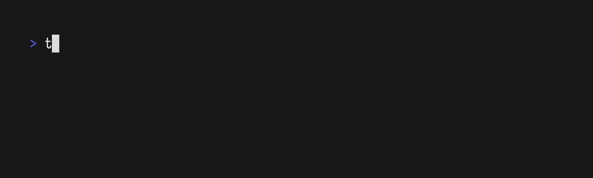

Want to theme your tmux status line? Great! Here's how.

## Step 1: Clone this repository

<!-- x-release-please-start-version -->
```bash
mkdir -p ~/.config/tmux/plugins
git clone https://github.com/jals1212/themux.git ~/.config/tmux/plugins/themux
```
<!-- x-release-please-end -->

## Step 2: Edit your tmux configuration file

Using your favourite editor, edit the file `~/.tmux.conf`.

It should look like this:

```bash
set -g @themux_theme 'catppuccin_mocha'

run ~/.config/tmux/plugins/themux/themux.tmux
```

This will load the themux plugin and apply the defaults.
To apply the changes to your configuration file, exit tmux completely
and start it again. You can also run `tmux source ~/.tmux.conf`, but this may
not work as well when changing options.

## Step 3: Customize

The default configuration looks a little bland. Let's change it to
be a bit more colorful. Edit your tmux config again so it looks like this.

```bash
# Pick a softer palette.
set -g @themux_theme 'catppuccin_frappe'

# Compose the status line. Modules are name tokens placed in the row grammar
# "<left> / windows / <right>": here the window list sits on the left and the
# session module on the right.
set -g @themux_status_line_1 "windows / session"

run ~/.config/tmux/plugins/themux/themux.tmux
```

There is some new stuff here. The `set -g ...` lines set tmux "options" (`-g` makes
an option global). An option whose name begins with `@` is a "user" option — themux
reads its own `@themux_*` options to build the look.

`@themux_status_line_1` is themux's status-line **grammar**. `/` splits the row into
zones (`<left> / windows / <right>`), and a zone lists module names (a space gives
each module its own pill). themux owns tmux's `status-format`, so it composes the
whole bar from these rows — you do not set `status-left` / `status-right` yourself.
See the "[Status Line reference](../reference/status-line.md)" for the full grammar
and the available modules.

If everything is working right, your version should look like this:


