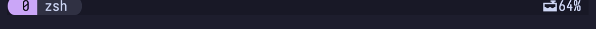

# Adding your own status line content

themux builds the status line from module **name** tokens in the row grammar
(`@themux_status_line_1` … `_5`; see the
[Status Line reference](../reference/status-line.md)). Beyond the built-in modules,
you can pin your own content to a row.

## Arbitrary content: prepend / append

`@themux_status_line_<N>_prepend` and `@themux_status_line_<N>_append` pin any
content — text, emoji, `#{...}` formats, `#[...]` styles or `#(command)` output — to
the far left / far right of that row. For example, a flamingo "used memory" pill on
the right (macOS):

```sh
set -g @themux_status_line_1_append \
  "#[bg=#{@thm_flamingo},fg=#{@thm_crust}] 󱀙 #(memory_pressure | awk '/percentage/{print $5}') "
```



The `#[...]` syntax is an embedded style, similar to inline CSS: `bg=#{@thm_flamingo}`
paints the background with the theme's flamingo accent and `fg=#{@thm_crust}` the
text. Use `set -g` here, **not** `-gF`: the `#{@thm_*}` and `#(...)` must stay
literal so tmux resolves them at *draw* time — `@thm_*` are user options the plugin
creates, so they only exist once themux has loaded, and `-gF` would expand them
immediately (before the palette exists, leaving `bg=` empty). `#(...)` runs a shell
command and inserts its output, and `#H`, `#S`, … are the usual tmux format codes.

> A literal `%` in a plain string must be written `%%` — tmux reads `%` as a
> `strftime` escape. Output produced by `#(command)` is inserted as-is.

## A theme-styled module

To get a pill that matches the built-in modules — the same shape, variants and
padding — model it on the shipped ones. Each `modules/<name>.conf` sets three
options and registers the module:

```sh
set -ogq "@themux_<name>_icon"  "<glyph> "
set -ogq "@themux_<name>_color" "#{E:@thm_pink}"   # a @thm_* accent
set -ogq "@themux_<name>_text"  "#{pane_current_command}"
source "<path to themux>/utils/module_block.conf"
```

Copy one of the existing modules as a template, then add your module's name to a
`@themux_status_line_*` row. Per-module overrides (`@themux_<name>_shape`,
`@themux_<name>_padding`, `@themux_<name>_text_variant`, …) tune just that pill — see
the [Configuration reference](../reference/configuration.md).
